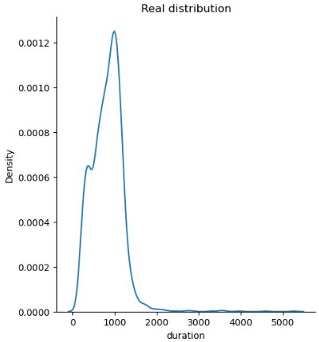

# Machine Learning Course (graduate) Programming Assignments, Spring 2022.

1. **Naive_Bayes_Scratch.ipynb**: Implementation of the Naive Bayes Classifier from scratch and applying it to the **Penguins dataset** with three species (labels). The classifier is binary in nature, but the **one-vs-all** technique is used to classify the three species. The results of the self-implemented Naive Bayes is compared to the one pre-implemented in the **SKlearn library**.

| self-implemented NB | SKlearn NB|
| ---- | ---- |
|  |  |

 
 
 

2. **Logistic_Regression_Scratch.ipynb**: Implementation of the Logistic Regression Classifier from scratch. The model gets two set of points to distinguish; however, the classese are **not linearly separable**. I applied a **Phi-transform** on the points, but the model gets complex when the degree of the Phi-transform increases. The effect of **L2-regularization term** on model accuracy is also discussed.

| Well-fitted Boundary | Overfitted Boundary | L2-term |
| ---- | ---- | --- |
|  |  |  |

 
 
 

3. **PCA_LDA_dimension_reduction.ipynb**: Reducing the number of features in a **facial expression** dataset using PCA and LDA methods. Sorting the eigen vectors based on their corresponding eigen values, we can see how suitably the instances are mapped with primary components.
   
  

 
 
 

4. **Parzen_Window_Scratch.ipynb**: Implemeting the unsupervised Parzen Window method for density estimation. The effects of window size and number of samples in the dataset are discussed. The resutls of the self-implemented Parzen Window are compared with the **SKlearn KernelDensity()**.  

| Target Distribution | Self-implemented Parzen | SKlearn Parzen |
| ---- | ---- | --- |
|  |  |  |

 
 
 

5. **SVM_Classifier.ipynb**: Employing Support Vector Machine Classifier with linear, RBF, and polinomial kernels to classify the **Iris dataset**. The effect of Gamma and C hyperpameters determining the model complexity (Hard/Soft SVM) are analyzed.

 

 
 
 

6. **GMM_density_estimation.ipynb**: I applied the unsupervised method of GMM to cluster images belonging to Chelsea and Manchester United based on the mean of red and blue colors in pixcels. Two gaussian mixtures are fitted on each class.

 

